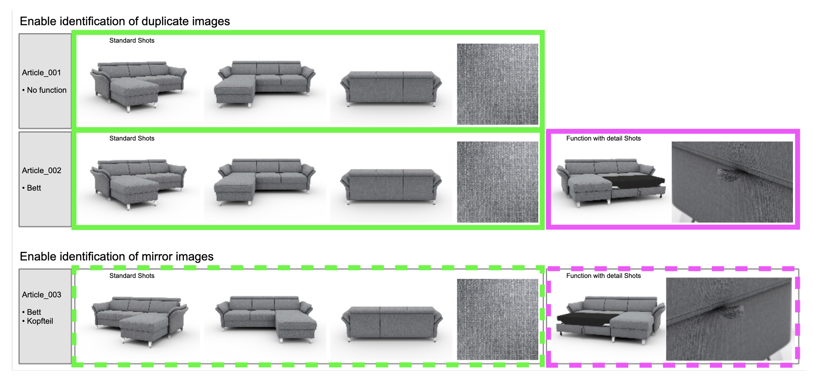
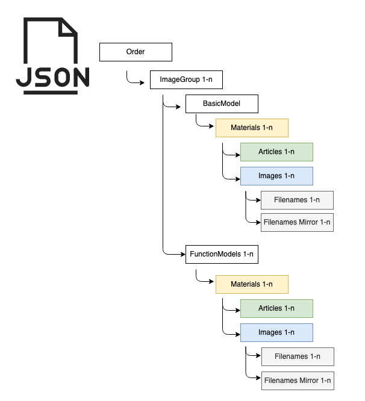
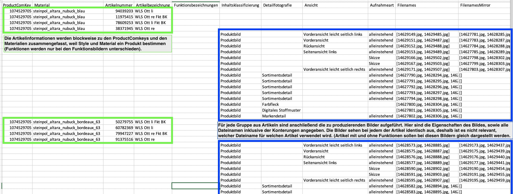
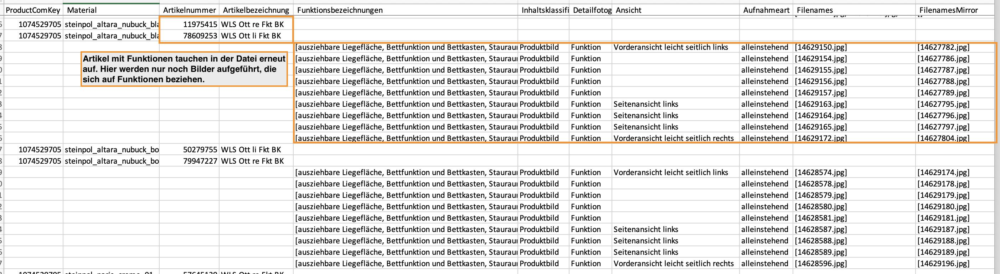
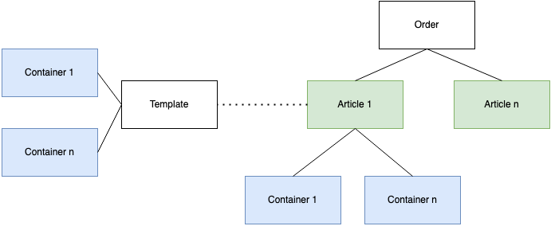
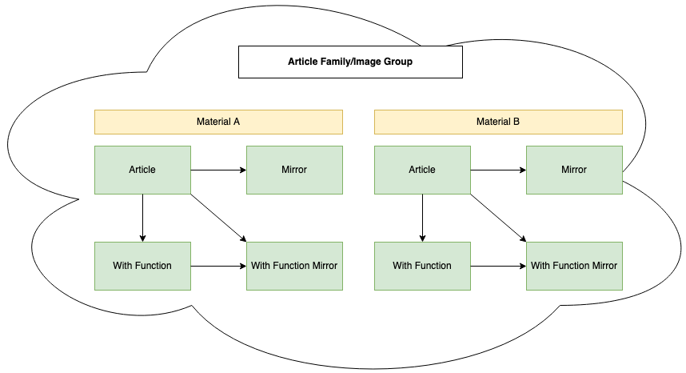
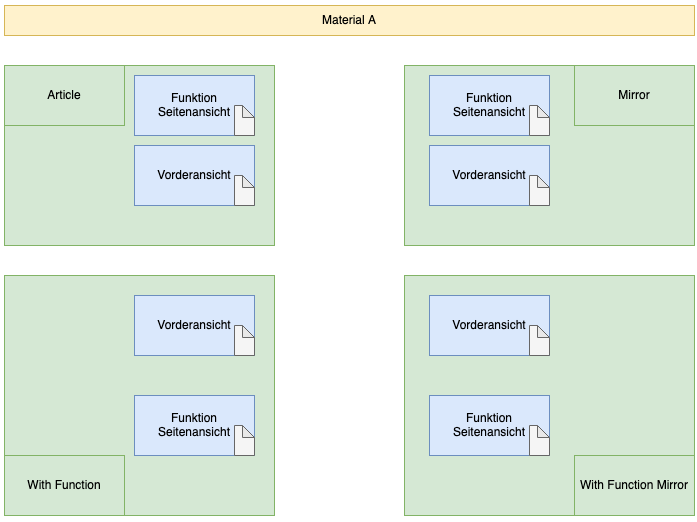
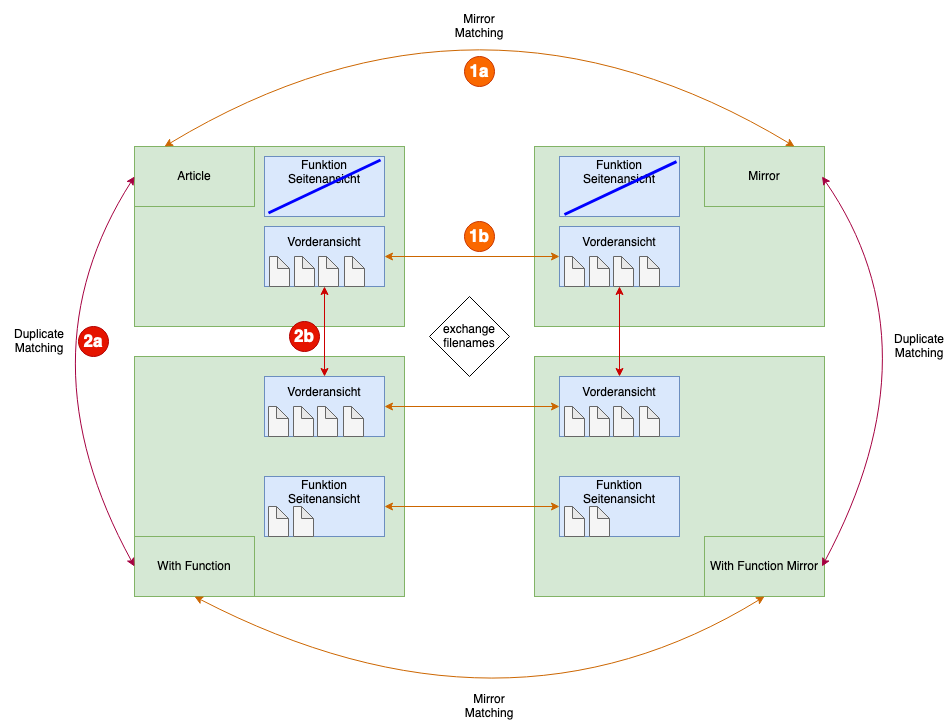
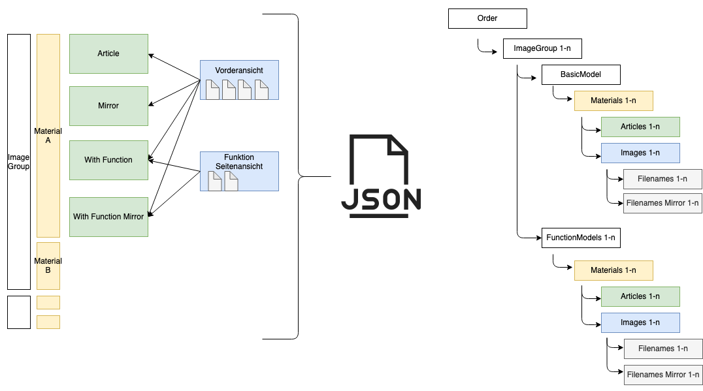

# Use Case
Das Programm erzeugt aus den Daten einer CGI-Beauftragung (Order) eine JSON- bzw. CSV-Datei. 
Das Ziel der Datei ist es, einem CGI-Studio in strukturierter Form mitzuteilen, welche beauftragten CGI-Bilder lediglich Duplikate und Konterungen anderer Bilder sind.
* Eine Konterung entsteht dann, wenn z.B. ein Sofa wahlweise mit linker oder rechter Liegefläche aufgebaut werden kann.
* Ein Duplikat entsteht dann, wenn z.B. ein Sofa seine Bilder einem Sofa mit Schlaffunktion "vererbt".

In folgendem Beispiel besitzt Artikel 2 Duplikate von Artikel 1 (grün) und Artikel 3 besitzt Konterungen von Artikel 2 (grün und rosa gestrichelt).



# Ausgabeformate

Die Informationen der Duplikate und Konterungen werden als JSON- und CSV-Datei exportiert.

## JSON Format
Im JSON-Format werden die Bildinformationen einer Order in folgender Struktur dargestellt:


* Order: 

    Der Root-Knoten des JSON-Files. Eine JSON-Datei wird immer pro Order erstellt.

* Image Group

    Gruppierung eines Produkts. Alle Artikel, die Variationen eines Produkts darstellen und sich prinzipiell Bilder teilen können.

* Basic Model

    Darstellung des "Basis"-Artikels. Also alle Bilder, die den Artikel ohne Funktionen darstellen und somit auf Varianten des Artikels "vererbt" werden können.
    
* Function Models

    Darstellung aller Artikel mit Funktionen. Hierunter sind nur Funktionsartikel und Funktionsbilder gruppiert. 
    
* Materials

    Material und Farbe der Artikel. Das übergeordnete 3D-Modell muss mit diesen Materialien
    und Farben versehen werden. 
* Articles
    
    Liste der Artikel, die den oben aufgeführten Kriterien entsprechen. Alle Bilder auf gleicher Ebene werden einem dieser Artikeln zugeordnet.
    
* Images

    Liste aller Bilder, die für die Artikel zu erstellen sind. Hier wird z.B. die Aufnahmeart des Bildes angegeben.
    
* Filenames

    Dateinamen unter denen das Bild abzulegen ist. Jeder Dateiname entspricht dabei einem Duplikat - also einer Variante des Produkts, die dieses Bild im Shop anzeigt. Dateinamen werden von MMP automatisch den Artikeln zugeordnet.
    
* Filenames Mirror
    
    Dateinamen der gespiegelten Bilder. Ein CGI-Studio muss das entsprechende Bild kontern und unter diesen Dateinamen abspeichern. 
    Dateinamen werden von MMP automatisch den Artikeln zugeordnet.   
    
## CSV Format




# Funktionsweise der Applikation

## Struktur der Auftragsdaten in MMP
Zuerst werden die Daten zu einer Order aus MMP gelesen. Artikellstammdaten werden aus M2 gelesen.

Bei der Anlage einer Order werden Artikel über das MMP zu einer Order hinzugefügt und jedem Artikel ein Bilder-Template zugeordnet. 
Das Template gibt an, welche Container der Artikel in der Order enthalten soll. 
Ein Container repräsentiert dabei ein einzelnes Bild. 
Bspw. könnte ein Template festlegen, dass zu einem Artikel eine Vorderansicht, eine Seitenansicht von links, 4 Funktionsbilder usw. zu erstellen sind.

Bei der Erstellung des Auftrags werden dann aus den Artikel-Template-Beziehungen die tatsächlichen Container jedes Artikelbilds in der MMP-Datenbank abgelegt. 
Jeder Container erhält eine eindeutige ID, über die das hochgeladene Bild dem Artikel sowie seiner Ansicht usw. zugeordnet werden kann. 
Ein hochgeladenes Bild muss dabei die Container-Id als Filename tragen.



Durch die Zuordnung von diesen sehr allgemein gehaltenen Templates, die universell auf viele Artikel zutreffen sollen, kommt es vor, dass einem Artikel durch Templates mehr Ansichten zugeordnet werden, als dieser aufweisen kann. 
Bspw. könnte ein Template ein Funktionsbild und ein Sortimentsdetail vorsehen, jedoch einem Artikel zugeordnet sein, der beides gar nicht besitzt. 
Diese Unschärfe ist der Verallgemeinerung der Templates geschuldet und verursacht auch im Ergebnis der Applikation eine Unschärfe. 
Solange MMP als Datenquelle für Auftragsdaten genutzt wird, ist nicht vorgesehen, von dieser Template-Container-Lösung abzusehen.

## Ziel
Die Aufgabe der Applikation ist es, innerhalb eines Auftrags eine Zuordnung zwischen Artikeln zu erzeugen, die entweder Konterungen oder Duplikate voneinander sind und auf Basis dieser Zuordnung die gespiegelten und duplizierten Bilder auszutauschen. 

Intern im Programm wird eine solche Verknüpfung von Artikeln "Image Group" genannt. 
Diese Beziehungen entstehen logischerweise nur bei Artikeln, die sich auf dasselbe Produkt beziehen. 
Dieses Produkt kann in unterschiedlichen Materialien und Farben vorkommen. 
Innerhalb einer Materialgruppe können dann die Beziehungen wie "Spiegel" oder "Artikel mit Funktion" entstehen.



Diese Artikelzuordnungen müssen zunächst aufgebaut werden, um später gemeinsame Bilder zusammenfassen zu können. 
Hier würde also:
* Der "Basis"-Artikel seine "Basis"-Bilder auf sein Spiegel-Pendant "vererben", sowie auf den Artikel, der eine zusätzliche Funktion besitzt und wiederum dessen Spiegel.
* Der Funktionsartikel würde seine Funktionsbilder wiederum auf seinen Spiegel "vererben".

## Article-Matching und Image-Merging

Ausgehend von der oben dargestellten Struktur einer Image Group, kann man nun beispielhaft folgende Artikel-Container-Kombination veranschaulichen: Für ein Set aus "Basis"-Artikel, Spiegel, Funktionsartikel und Funktionsspiegel sind jeweils eine Vorderansicht (ohne Funktion) und eine Seitenansicht für Funktionen angefordert.



Ziel der Applikation ist es, die Beziehungen zwischen den Artikeln zu ermitteln und darauf basierend gleiche Container miteinander zu verknüpfen. 
Dies geschiet in jeweils vier Schritten:
* Mirror-Matching
* Mirror-Merging
* Duplicate-Matching
* Duplicate-Merging

Zunächst werden aber durch einen Filteralgorithmus Funktions-Container in Artikeln ohne Funktion entfernt. Durch das Matching und Merging tauschen sich anschließend alle zusammengehörenden Container der verknüpften Artikel ihre Filenames aus.
Auf diese Weise hat jeder Container die Information, welche Dateien tatsächlich aus der jeweiligen Ansicht erzeugt werden müssen. Auf diese Weise werden am Ende des Algorithmus alle zusammengehörigen Container identische Informationen über ihre Dateinamen besitzen.



Diese Teilschritte sind in jeweils separaten Klassen implementiert. 
Durch diese Trennung aller Teilschritte lassen sich Unit Tests implementiern, die konkret den jeweiligen Aspekt testen und die Algorithmen losgelöst von den restlichen Funktionalitäten des Matchings und Mergings auf Korrektheit prüfen.

### 1a Mirror-Matching

Im ersten Schritt werden alle Artikel auf Konterungen geprüft. Eine Konterung besteht dann, wenn zwei Artikel:
* derselben Image Group zugeordnet werden können (identische StyleId und Abmessungen),
* dieselben Materialien besitzen,
* dieselben Funktionen besitzen und
* ein Artikel eine Liegefläche links und der andere eine Liegefläche rechts hat.

### 1b Mirror-Merging

Der zweite Schritt der Konterungsverarbeitung führt die zu spiegelnden Container zusammen.
Zunächst werden in allen Spiegel-Artikeln die Filenames vom Attribut Filenames in das Attribut FilenamesMirror verschoben.
Anschließend werden alle Filenames aus zusammengehörenden Containern der gespiegelten Artikel ausgetauscht.
In diesem Schritt tauschen sich Filenames also nur einnerhalb einer Ebene mit gleichen Funktionen (bzw. ohne Funktion bei  "Basis"-Artikeln) aus.

### 2a Duplicate-Matching

Anschließend werden über alle Artikel die Duplikate ermittelt.
Für die Duplikatermittlung wird verglichen, ob zwei Artikel:
* sich in derselben Image Group befinden und
* die selben Materialien aufweisen.

### 2b Duplicate-Merging

Ausgetauscht werden in diesem Schritt lediglich die Filenames von nicht-Funktions-Containern. 
Ein Funktionsbild soll sich nicht auf eine andere Funktions-Ebene "vererben".

### Resultat

Durch die oben dargestellte Zusammenführung zusammengehörender Filenames lässt sich im internen Datenmodell nun folgende Order-Struktur aufbauen und abschließend in die gewünschten Dateiformate JSON und CSV konvertieren:



# Ausführung
Der Use Case beginnt damit, dass ein CGI-Mitarbeiter eine Anfrage bzgl. einer Beauftragung beim Team Order stellt und endet damit, dass ihm die erforderlichen Dateien zur Verfügung gestellt werden.
## Vorbedingungen
Für die Ausführung des Programms muss der entsprechende Auftrag bereits im MMP angelegt sein.

Wenn das Programm für einen produktiven Auftrag eingesetzt werden soll, teilt der CGI-Mitarbeiter dem Entwickler die Auftragsnummer mit.
In der Regel wird der Entwickler bereits bei der Auftragserstellung in den Email-Verteiler als Empfänger der Auftragsnachricht eingetragen. Durch den Erhalt der Email ist der Entwickler dann informiert, dass das Programm für einen neuen Auftrag auszuführen ist. 
Die Auftragsnummer kann aber auch über andere Wege mitgeteilt werden, sodass der Erhalt der Auftrags-Email nicht immer notwendig ist.

## Input
Als Input wird lediglich die Auftragsnummer des entsprechenden Auftrags benötigt.

## Programmausführung
Es dürfen nur Aufträge verarbeitet werden, die zuvor geprüft wurden.
Die anschließende Programmausführung erzeugt die Ausgabedateien.


Bem Start der Prüfung und der Ausführung sind folgende Environment Variable zu setzen:
```bash
ORDER_NUMBER=[Auftragsnummer]
MMP_PROD_URL=http://mmp-prod.ov.otto.de/media_production/api
M2_PROD_URL=https://api.prod.m2.ov.otto.de
MMP_SECRET_NAME=mmp-order-mmp-credentials
M2_SECRET_NAME=m2-stage-api-credential
AWS_REGION=eu-central-1
```
Die entsprechenden Benutzernamen und Passwörter für M2 und MMP sind im AWS Secrets Manager hinterlegt.
Dementsprechend muss auch eine Verbindung zum AWS-Account über ```saml2aws login ``` aufgebaut werden.
### Auftragsprüfung
Datenschiefstände in den Aufträgen, die z.B. aus falsch gepflegten Daten in M2 oder Primary entstehen können, führen zu fehlerhaften Dateien, die nicht an das Studio weitergeleitet werden dürfen.

Für die Prüfung wird die Main-Methode der Klasse devtools.ArticleQualityInspector ausgeführt.
Die Ausgabe der Main-Funktion gibt zwei Merkmale der Artikel aus:
- Material-ID:
Da die Material-ID verwendet wird, um zusammengehörige Artikel zu gruppieren, darf die Material-ID an keinem der Artikel fehlen bzw. falsche Angaben beinhalten. 
Fehlende Material-IDs werden dem CGI-Mitarbeiter mitgeteilt, der den Category-Mitarbeiter darauf hinweist, diese im Primary (Hinweis: X-FIT, Merkmal_KZ = 1062, ART_MERKMAL) nachzutragen.
Ebenfalls ist es vorgekommen, dass Material-Ids nicht mit der technischen Bezeichnung sondern einem Dateinamen z.B. my_material_id.jpg angegeben wurden.
Deshalb wird ebenfalls auf die Dateiendung jpg bzw. jpeg geprüft, um dadurch falsche Angaben bei der Material-Id zu identifizieren.
Artikelnummern mit fehlenden oder falscher Material-IDs werden in der Ausgabe folgendermaßen ausgegeben:
```bash
Article numbers with invalid material:
```
- Funktionen:
Da die Angaben der Funktionen dem CGI-Studio als Hilfestellung dienen, welche Funktionsbilder zu produzieren sind, werden vorab die Artikeldaten auf Unstimmigkeiten bei den Funktionsbezeichnungen geprüft.
Bspw. könnten in diesen Feldern fälchlicher Weise Bezeichnungen auftauchen, die keine Funktionen sind (z.B. Materialien), oder widersprüchliche Angaben gepflegt sein (z.B. mit Liegefläche und ohne Bettfunktion ).
Es könnte auch vorkommen, dass zu einem Artikel mit Funktionen im Quellsystem keine Informationen über die Funktionen vorhanden sind.
Dies wäre daran zu erkennen, dass ein Artikel bspw. die Bezeichnung "ECK,OTTre,FKT,BK,KV" für „Ecksofa, Ottomane rechts, Funktion, Bettkasten, Kopfteilverstellung" trägt aber keine Funktionen in der Analyse zugeordnet hat.
Darum sind diese Angaben manuell auf Sinnhaftigkeit zu prüfen und bei Unstimmigkeiten der CGI-Mitarbeiter heranzuziehen. 
Die Korrektur der Daten geschieht in Primary (Hinweis: X-FIT, Merkmal 1066).
Die Funktionsbezeichungen und die dazugehörigen Artikel werden unter folgender Ausgabe aufgeführt:
```bash
Article functions:
```
### Auftragsverarbeitung
Zum Starten des Programms muss die Main-Methode der Klasse ServiceRunner im Hauptpaket ausgeführt werden. 

Nach Aufruf der Main-Funktion werden die Dateien unter dem Pfad ```[Auftragsnummer]/``` abgelegt.
Zusätzlich werden unter dem Ordner ```cache/``` die Auftrags- und Artikeldaten lokal persistiert.
Dadurch ist bei einer erneuten Ausführung keine Verbindung zu M2 oder MMP notwendig.
## Abschluss
Nachdem die Dateien erstellt wurden, sollten diese noch stichprobenartig auf Plausibilität geprüft werden. 
Interesant sind z.B. die Verknüpfungen der Artikel mit Duplikaten und Konterungen und das Vorhandensein aller relevanter Funktionen laut Artikelbezeichnung.
Die erstellten Dateien werden dem CGI-Mitarbeiter, der den Auftrag erstellt hat, manuell zugesendet.
Dieser kümmert sich an die Weiterleitung an das CGI-Studio.

# System Tests

Die Systemtests bilden die End-to-End-Tests ab. 
Dabei wird die Apllikation als Gesamtes mit all ihren Funktionen aufgerufen und auf Korrektheit geprüft.
Als Testdaten werden die APIs für MMP und M2 mit Rückgabewerten aus echten Aufträgen der vergangenen Auftragsphasen gemockt und mit den zu erwartenden JSON- und CSV-Dateien inhaltlich verglichen.
Es stehen im Resources-Ordner der Tests also für jeden Systemtest Dateien bereit, die für Artikel und Aufträge die API-Responses mocken, sowie die bereits generierten Ausgabedateien, die zum letztendlichen Vergleich herangezogen werden.

## Einen Auftrag als neuen Systemtest hinzufügen
In der Regel kann jeder neue Auftrag, der für die Produktion erstellt wurde, den Systemtests hinzugefügt werden.
Dadurch wird der Testumfang der Systemtests erweitert und bei zukünftigen Anpassungen zusätzliche Datenkonstellationen geprüft.
Die Ressourcen des neuen Auftrags lassen sich hinzufügen, indem die Klasse ```SystemTestResourcesGenerator``` mit der entsprechenden Auftragsnummer ausgeführt wird.
Die Umgebungsvariablen sind dabei, wie im Abschnitt "Programmausführung" beschrieben, zu setzen.
Anschließend muss noch der Junit-Test analog der bestehenden Systemtests hinzugefügt werden.
Dazu ist in dem Package ```systemtest.real_orders_from_live_system``` folgende Klasse zu erstellen:
```
public class when_testing_order_[Auftragsnummer] {
    @Test
    public void then_expect_expectation() throws ApplicationFailed {
        new SystemTest()
                .forOrderNumber("[Auftragsnummer]")
                .worksWithDirectory("systemtest/real_orders_from_live_system/[Auftragsnummer]")
                .mocksApisFromGivenDirectory()
                .andExpects().expectationFileInGivenDirectory("exp.json", OutputFormatType.JSON)
                .andExpects().expectationFileInGivenDirectory("exp.csv", OutputFormatType.CSV)
                .whenExecutesWholeSystem();
    }
}
```

## Alle Systemtests aufgrund einer inhaltlichen Anpassung aktualisieren
Sollte es einmal aufgrund einer Anpassung an dem Service zu einer inhaltlichen Änderung der Ausgabedateien kommen 
(z.B. Änderung von Spaltennamen oder Anpassungen am Aufbau der JSON-Datei), dann müssen logischerweise auch die 
vorliegenden Ausgabedateien im Test-Resources-Ordner angepasst werden, da sonst die neue Änderung immer als fehlerhafter Test angezeigt werden würde.

Normalerweise wird so eine Änderung an einem solchen Expectation-Fixture manuell vorgenommen.
Da es sich hier aber um zig Expecation-Dateien handelt und die entsprechende Anpassung in jeder Datei vielfach vorkommen kann, 
ist eine manuelle Anpassung hier nicht praktikabel und es muss eine automatisierte Aktualisierung aller Testressourcen eingesetzt werden.

Für diesen Fall wäre lediglich in der Klasse ```SystemTestExecution``` die Injection des ```PersisterMock``` auszuschalten. 
Alle Systemtests würden somit ihre Erwartungswerte mit dem tatsächlich generierten Stand überschreiben. 

Folgende Zeile ist gemeint und kann für die Aktualisierung der Erwartungswerte auskommentiert werden:
```bash
new PersisterMock();
```
Nach der Ausführung ohne den Mock ist die Stelle wieder einzufügen.
Die Systemtests sind anschließend alle erfolgreich, da der Erwartungswert gerade mit dem tatsächlichen Wert überschrieben wurde.

Durch einen Push würden sowohl die funktionalen Änderungen am Code als auch die Testressourcen gemeinsam commitet werden,
wodurch dann auch Jenkins die Änderung mit den aktualisierten Expecations testen kann. 
Die Aktualisierung der Ressourcen ist also nur einmal lokal durchzuführen.
